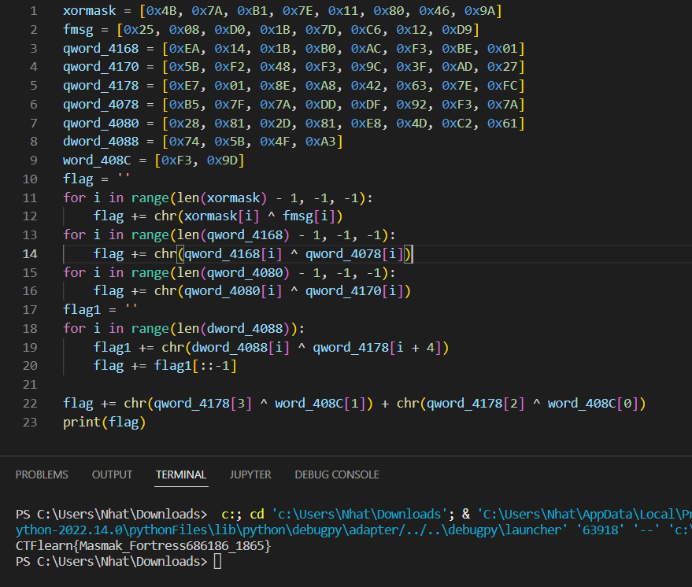

# Riyadh
## B1: 
Dùng lệnh `file Riyadh`  ta thấy file có dạng `LF 64-bit LSB pie executable, x86-64, version 1 (SYSV), dynamically linked, interpreter /lib64/ld-linux-x86-64.so.2, BuildID[sha1]=393ea266da40acda58b1102e4aa0433cbf87174e, for GNU/Linux 3.2.0, not stripped`
## B2: 
Mở file bằng IDA pro 64 bit. Nhấn F5 để generate pseudocode
## B3:
Mở Msg5. Sau đó viết code xử lí. Ta tìm được flag

Flag là: `CTFlearn{Masmak_Fortress686186_1865}`
